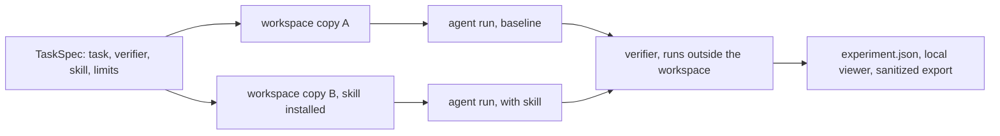

# Skill Issue

<p align="center">
  
</p>

<p align="center"><sub><strong>GJUSEV / FIELD TOOL 02</strong> &nbsp;·&nbsp; PROVE THE SKILL</sub></p>

[](https://github.com/Gjusev/skill-issue/actions/workflows/ci.yml)

> Do your skills help the agent, or just take up context?

Skill Issue is a local evidence harness for that question. It runs one bounded task from the same starting bytes in two variants: a baseline with no target skill, and a variant with it. An independent verifier, the run trace, the resulting file changes, and any reported time or token measurements stay together in one inspectable experiment.

There is no hosted backend, account, or telemetry. You choose the task and keep the resulting evidence on your machine.

This is what the tool printed after a real two-run comparison against Claude Code 2.1.294 on the example task:

```
success criterion: RELEASE_NOTES.md exists and contains the sections Changelog, Known Issues and Roadmap, in that order
skill: release-notes-format (ac8e8031)
  [baseline r1] FAILED  18930ms  tokens: 34955in/299out   $0.1996
  [skill r1]   PASSED  35238ms  tokens: 34409in/629out   $0.2058
  Descriptive comparison with 1 repetition(s): insufficient evidence for superiority claims.
```

That is one observed comparison, not a universal ranking. Skill Issue reports what happened in these runs and keeps the evidence visible; it does not pronounce a "best" skill from a smoke test. The repository is checked by 75 unit/integration tests, 10 CLI end-to-end tests, a real-browser e2e, and live Claude Code 2.1.294 smoke runs. The suite has been exercised on Windows 11 and Ubuntu with Node 22.18 and 24.

## Before → after: one claim becomes an experiment

| Before Skill Issue | After Skill Issue |
| --- | --- |
| "This skill feels useful." | A task, starting workspace, exact skill revision, verifier, trace and changed files are kept together. |
| One success becomes "the skill is better." | The report labels the result as observed evidence and says when repetitions are insufficient for that claim. |
| Baseline and skill runs drift because the environment changed. | Both variants start from the same bytes and an external verifier checks the stated success criterion. |

## Start with a no-cost fixture

Install it as a CLI (Node.js 22.18+):

```bash
npm install -g skill-issue-tool
skill-issue --version
```

Or work from a clone:

```bash
git clone https://github.com/Gjusev/skill-issue
cd skill-issue
npm install
npm test                # engine, runners, sanitization, comparability; no model, no keys
npm run test:cli        # full CLI journey (init/validate/run/report/export) as subprocesses
npm run test:e2e        # viewer in a real browser; needs a local Edge/Chrome, skips if absent

# Run the complete fixture demo. It uses no model and no keys.
node src/cli.ts validate examples/tasks/release-notes.fixture.json
node src/cli.ts run examples/tasks/release-notes.fixture.json
node src/cli.ts viewer  # then open http://127.0.0.1:4173
```

The demo compares a "release notes" task with and without the example `release-notes-format` skill. The scripted baseline writes free-form notes and fails the verifier; the skill variant reads the skill and passes. It exercises the complete pipeline, but it is explicitly a fixture run and says nothing about a real agent's effectiveness.

## Run a real agent deliberately

The Claude Code runner consumes model usage, so it is never started by import, preview, or the viewer. It needs an authenticated `claude` CLI and Node.js 22.18+:

```bash
node src/cli.ts prepare examples/tasks/release-notes.claude-code.json
node src/cli.ts run examples/tasks/release-notes.claude-code.json
```

`prepare` shows the exact plan and limits without consuming a model. `run` is the explicit execution step. The harness creates a fresh configuration directory per run; it isolates experiment state, not the machine, so only use tasks and skills you trust.

## What one experiment looks like



Three pieces make an experiment, all defined in a versioned `TaskSpec`:

- a starting workspace, plain files whose bytes both variants share
- a verifier, a script outside the workspace that exits 0 only when the success criterion holds; the engine hashes it before and after each run, and the agent never grades its own work
- the skill under test, installed into one workspace as a project skill

Two runners can execute the plan. `claude-code` drives the real CLI headless, and each run gets its own empty `CLAUDE_CONFIG_DIR`, project-only settings and no machine MCP servers or plugins, so the baseline is not contaminated by whatever is installed on your machine. `fixture` is a scripted agent with no model that speaks the same stream format; it is for testing the harness and demoing the flow without spending anything.

The viewer puts the variants side by side with activation evidence, change lists and measurements. Numbers the runner did not report read "not measured", never 0. The shareable export strips prompts, raw traces and absolute paths by default and keeps hashes instead.

## Commands

| command | what it does | model? |
|---|---|---|
| `init [dir]` | scaffold a working comparison: TaskSpec, workspace, verifier, skill | no |
| `validate <spec>` | check a TaskSpec and its paths | no |
| `prepare <spec>` | show the execution plan and limits | no |
| `run <spec>` | execute the experiment | yes, unless the runner is `fixture` |
| `report <experimentDir>` | text summary of an experiment | no |
| `export <experimentDir>` | write the sanitized shareable export | no |
| `viewer [--data-dir] [--port]` | serve the local web viewer | no |

## The words the tool is strict about

| term | meaning |
|---|---|
| installed | SKILL.md exists in the run's workspace config; the engine checks this before the agent starts |
| observed read | the run's event stream shows the skill being invoked or read |
| verifier passed | an independent script observed the success criterion |

Three separate claims, labeled separately in the viewer, and none implies the next one. Token and cost fields the runner did not report are null, shown as "not measured", and never estimated. If starting bytes, configuration or verifier integrity differ between variants, the records are marked `invalid_comparison` and carry no weight as evidence. An `infrastructure_error` is a harness or provider problem, not a task failure.

## Scope and limits

Comparisons are descriptive. Claiming a skill is better needs several repetitions per variant and more than one task, and even then this tool will show you differences rather than statistics. The harness isolates configuration, not the machine: workspaces are plain directories, so run only tasks and skills you trust. The budget limit is passed to the runner's supported flag and is not a hard spend guarantee. Only the Claude Code runner has been validated; nothing here claims support for other CLIs.

The skill in [`skills/skill-issue/SKILL.md`](skills/skill-issue/SKILL.md) walks an agent through framing a verifiable task, previewing without cost, running with explicit confirmation, and reading reports without inventing conclusions.

### Using the skill in different agent harnesses

The skill is plain files: `SKILL.md` plus the `references/` folder next to it. The universal installer works straight from this repository (verified; it carries the references along):

```bash
npx skills@latest add Gjusev/skill-issue              # pick your agent interactively
npx skills@latest add Gjusev/skill-issue -a cursor    # or name it: cursor, opencode, codex, windsurf, amp, ...
npx skills@latest update                              # later, to pick up changes
```

For Claude Code, either use the same installer or copy the folder directly (verified):

```bash
cp -r skills/skill-issue  /your/project/.claude/skills/     # project level
cp -r skills/skill-issue  ~/.claude/skills/                 # user level
```

### Claude Code plugin

Claude Code users can also install the managed plugin from this repository's
marketplace:

```text
/plugin marketplace add Gjusev/skill-issue
/plugin install skill-issue@skill-issue
```

Two things to keep in mind:

- The skill needs the CLI reachable: either a clone of this repository or `npm install -g skill-issue-tool`. The skill tells the agent to locate it; point your agent at the clone path if it asks.
- You do not need any harness to use the tool itself. The CLI commands (`init`, `validate`, `prepare`, `run`, `report`, `export`, `viewer`) are harness-independent; the skill only teaches an agent the workflow around them.

<details>
<summary>Project layout</summary>

```
src/core/       engine, TaskSpec/RunRecord, hashing, sanitization, export
src/runners/    spawn + tree kill, stream parser, fixture and claude-code runners
src/report/     local viewer server and UI
skills/skill-issue/   the distributable skill
examples/       synthetic task, verifier and example skill
fixtures/       test fixtures
tests/          unit and integration tests plus the browser e2e
```

</details>

<details>
<summary>Development</summary>

```bash
npm run typecheck   # tsc --noEmit
npm test            # node --test, fixtures only, no keys
npm run test:cli    # end-to-end: init, validate, run, report, export as subprocesses
npm run test:e2e    # browser e2e via puppeteer-core with a local Edge/Chrome
```

CI runs typecheck and tests on every push (`.github/workflows/ci.yml`). The real-agent smoke test stays out of CI on purpose: it needs authentication and spends money.

</details>

## License

MIT. See [LICENSE](LICENSE). Changes are tracked in [CHANGELOG.md](CHANGELOG.md).
