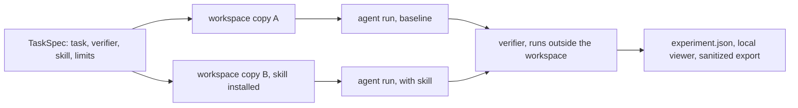

# Skill Issue

[](https://github.com/Gjusev/skill-issue/actions/workflows/ci.yml)

> Do your skills help the agent, or just take up context?

Skill Issue runs the same task twice, once without a skill (the baseline) and once with it, under identical conditions. Then it shows you what happened: whether the skill was installed and read, what an independent verifier observed, which files changed, and whatever time and token numbers the runner reports. Everything runs on your machine; there is no account, no backend, and nothing leaves it.

This is what the tool printed after a real two-run comparison against Claude Code 2.1.294 on the example task:

```
success criterion: RELEASE_NOTES.md exists and contains the sections Changelog, Known Issues and Roadmap, in that order
skill: release-notes-format (ac8e8031)
  [baseline r1] FAILED  18930ms  tokens: 34955in/299out   $0.1996
  [skill r1]   PASSED  35238ms  tokens: 34409in/629out   $0.2058
  Descriptive comparison with 1 repetition(s): insufficient evidence for superiority claims.
```

One run answers "what happened here?" It cannot answer "which skill is best", and the tool does not pretend otherwise. Everything this README claims is backed by checks: 75 unit and integration tests, 10 CLI end-to-end tests, a real-browser e2e, and live smoke runs against Claude Code 2.1.294 (including a two-repetition comparison with consistent results). CI runs on every push; the suite has passed on Windows 11 and Ubuntu, on Node 22.18 and 24.

## Quick start

Install it as a CLI (Node.js 22.18+):

```bash
npm install -g skill-issue-cli
skill-issue --version
```

Or work from a clone:

```bash
git clone https://github.com/Gjusev/skill-issue
cd skill-issue
npm install
npm test                # engine, runners, sanitization, comparability; no model, no keys
npm run test:cli        # full CLI journey (init/validate/run/report/export) as subprocesses
npm run test:e2e        # viewer in a real browser; needs a local Edge/Chrome, skips if absent

# Fixture demo, no model involved:
node src/cli.ts validate examples/tasks/release-notes.fixture.json
node src/cli.ts run examples/tasks/release-notes.fixture.json
node src/cli.ts viewer  # then open http://127.0.0.1:4173
```

The demo compares a "release notes" task with and without the example `release-notes-format` skill. The scripted baseline writes free-form notes and fails the verifier; the skill variant reads the skill and passes. That exercises the whole pipeline. It says nothing about real agents, and the report labels it as a fixture run.

To compare with a real agent (this consumes model usage, so it is an explicit step):

```bash
node src/cli.ts prepare examples/tasks/release-notes.claude-code.json
node src/cli.ts run examples/tasks/release-notes.claude-code.json
```

Node.js 22.18 or newer is required (the TypeScript source runs natively and there is no build step; the whole suite is verified on 22.18 and 24). The real runner also needs the `claude` CLI installed and authenticated.

## What one experiment looks like



Three pieces make an experiment, all defined in a versioned `TaskSpec`:

- a starting workspace, plain files whose bytes both variants share
- a verifier, a script outside the workspace that exits 0 only when the success criterion holds; the engine hashes it before and after each run, and the agent never grades its own work
- the skill under test, installed into one workspace as a project skill

Two runners can execute the plan. `claude-code` drives the real CLI headless, and each run gets its own empty `CLAUDE_CONFIG_DIR`, project-only settings and no machine MCP servers or plugins, so the baseline is not contaminated by whatever is installed on your machine. `fixture` is a scripted agent with no model that speaks the same stream format; it is for testing the harness and demoing the flow without spending anything.

The viewer puts the variants side by side with activation evidence, change lists and measurements. Numbers the runner did not report read "not measured", never 0. The shareable export strips prompts, raw traces and absolute paths by default and keeps hashes instead.

## Commands

| command | what it does | model? |
|---|---|---|
| `init [dir]` | scaffold a working comparison: TaskSpec, workspace, verifier, skill | no |
| `validate <spec>` | check a TaskSpec and its paths | no |
| `prepare <spec>` | show the execution plan and limits | no |
| `run <spec>` | execute the experiment | yes, unless the runner is `fixture` |
| `report <experimentDir>` | text summary of an experiment | no |
| `export <experimentDir>` | write the sanitized shareable export | no |
| `viewer [--data-dir] [--port]` | serve the local web viewer | no |

## The words the tool is strict about

| term | meaning |
|---|---|
| installed | SKILL.md exists in the run's workspace config; the engine checks this before the agent starts |
| observed read | the run's event stream shows the skill being invoked or read |
| verifier passed | an independent script observed the success criterion |

Three separate claims, labeled separately in the viewer, and none implies the next one. Token and cost fields the runner did not report are null, shown as "not measured", and never estimated. If starting bytes, configuration or verifier integrity differ between variants, the records are marked `invalid_comparison` and carry no weight as evidence. An `infrastructure_error` is a harness or provider problem, not a task failure.

## Scope and limits

Comparisons are descriptive. Claiming a skill is better needs several repetitions per variant and more than one task, and even then this tool will show you differences rather than statistics. The harness isolates configuration, not the machine: workspaces are plain directories, so run only tasks and skills you trust. The budget limit is passed to the runner's supported flag and is not a hard spend guarantee. Only the Claude Code runner has been validated; nothing here claims support for other CLIs.

The skill in [`skills/skill-issue/SKILL.md`](skills/skill-issue/SKILL.md) walks an agent through framing a verifiable task, previewing without cost, running with explicit confirmation, and reading reports without inventing conclusions. To use it with Claude Code, copy the `skills/skill-issue/` folder into your project's `.claude/skills/` directory (or into `~/.claude/skills/` for your user) and keep the repository itself cloned somewhere the commands can run from.

<details>
<summary>Project layout</summary>

```
src/core/       engine, TaskSpec/RunRecord, hashing, sanitization, export
src/runners/    spawn + tree kill, stream parser, fixture and claude-code runners
src/report/     local viewer server and UI
skills/skill-issue/   the distributable skill
examples/       synthetic task, verifier and example skill
fixtures/       test fixtures
tests/          unit and integration tests plus the browser e2e
```

</details>

<details>
<summary>Development</summary>

```bash
npm run typecheck   # tsc --noEmit
npm test            # node --test, fixtures only, no keys
npm run test:cli    # end-to-end: init, validate, run, report, export as subprocesses
npm run test:e2e    # browser e2e via puppeteer-core with a local Edge/Chrome
```

CI runs typecheck and tests on every push (`.github/workflows/ci.yml`). The real-agent smoke test stays out of CI on purpose: it needs authentication and spends money.

</details>

## License

MIT. See [LICENSE](LICENSE). Changes are tracked in [CHANGELOG.md](CHANGELOG.md).
